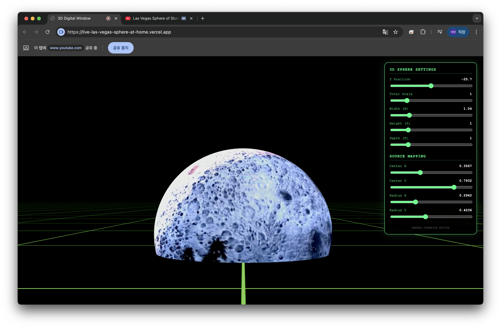
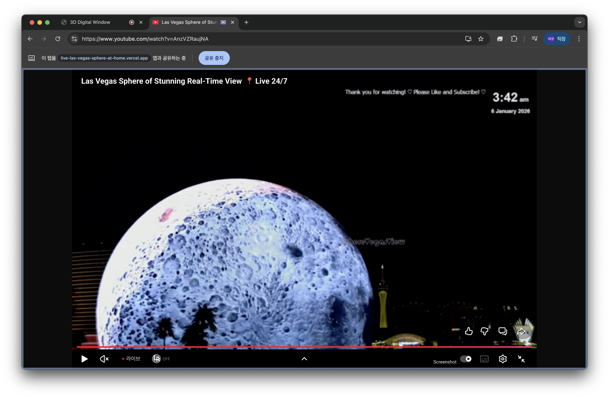
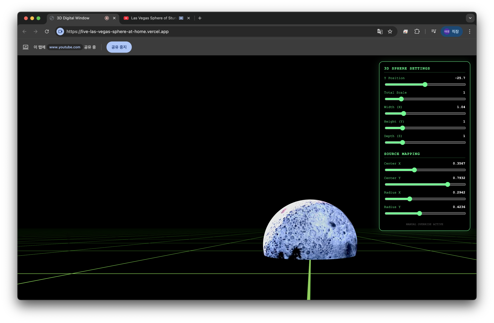

# 🌐 Live Las Vegas Sphere at Home

Bring the world's most impressive architectural marvel to your desk with this interactive 3D digital window. Using **Three.js** and **MediaPipe Face Mesh**, this project creates an immersive "anamorphic illusion" that tracks your head movement to provide a realistic perspective of the Las Vegas Sphere.



## ✨ Key Features

-   **👁️ Head-Tracked Off-Axis Projection**: Real-time perspective adjustment based on your eye position, creating a "digital window" effect that makes the 3D scene feel like it has depth beyond your screen.
-   **🔴 Live Sphere Connection**: Seamlessly map any live video source (like a YouTube stream of the Las Vegas Sphere) onto a 3D sphere geometry using screen sharing.
-   **🎛️ Real-Time Calibration**: Built-in UI panel to fine-tune the 3D sphere's position, scale, and video mapping parameters (center and radius) to perfectly match your source video.
-   **📐 Advanced Mapping**: Custom GLSL shader for precise spherical projection mapping of flat video sources.
-   **🏎️ High Performance**: Optimized rendering with Three.js and efficient face tracking with MediaPipe.

## 📸 Screenshots

| 1. Click Connect | 2. Open YouTube | 3. Go Full Screen |
| :---: | :---: | :---: |
|  |  |  |
| **4. Source Ready** | **5. Calibrate** | **6. Final Result** |
|  |  |  |

## 🚀 Getting Started

### Prerequisites

-   Node.js (v18 or higher recommended)
-   A webcam (for head tracking)

### Installation

1.  **Clone the repository**:
    ```bash
    git clone https://github.com/your-username/live_las_vegas_sphere_at_home.git
    cd live_las_vegas_sphere_at_home
    ```

2.  **Install dependencies**:
    ```bash
    npm install
    ```

3.  **Run the development server**:
    ```bash
    npm run dev
    ```

4.  **Open the app**:
    Navigate to `http://localhost:5173` in your browser.

## 📺 How to Connect the Live Sphere

To get the full experience, follow these steps to connect the live stream:

1.  Open the [Las Vegas Sphere Live Stream (YouTube)](https://www.youtube.com/watch?v=AnzVZRaujNA).  
    
2.  Set the YouTube video to **Full Screen** mode.  
    
3.  Back in this app, click the **"🔴 CONNECT LIVE SPHERE"** button.  
    
4.  Select the **"Window"** or **"Chrome Tab"** that is showing the full-screen YouTube video.
5.  The stream will be projected onto the 3D sphere in the scene.
6.  Use the **Calibration Panel** to align the content perfectly.  
    

## 🛠️ Calibration Guide

The calibration panel (top-right) allows you to adjust:

-   **3D Sphere Settings**: Move the sphere in 3D space (`Y Position`) and adjust its overall `Scale` or individual dimensions (`Width`, `Height`, `Depth`).
-   **Source Mapping**:
    -   `Center X / Y`: Shift the focus points of the video texture on the sphere.
    -   `Radius X / Y`: Adjust the "zoom" or coverage area of the video mapping.

## 🧰 Tech Stack

-   **[Three.js](https://threejs.org/)**: 3D engine for rendering the scene and sphere.
-   **[MediaPipe Face Mesh](https://google.github.io/mediapipe/solutions/face_mesh)**: AI-powered face tracking for perspective adjustment.
-   **[Vite](https://vitejs.dev/)**: Ultra-fast frontend build tool.
-   **GLSL**: Custom shaders for spherical projection.

## 📜 License

This project is licensed under the MIT License - see the [LICENSE](LICENSE) file for details.

---

*Made with ❤️ for immersive tech enthusiasts.*
